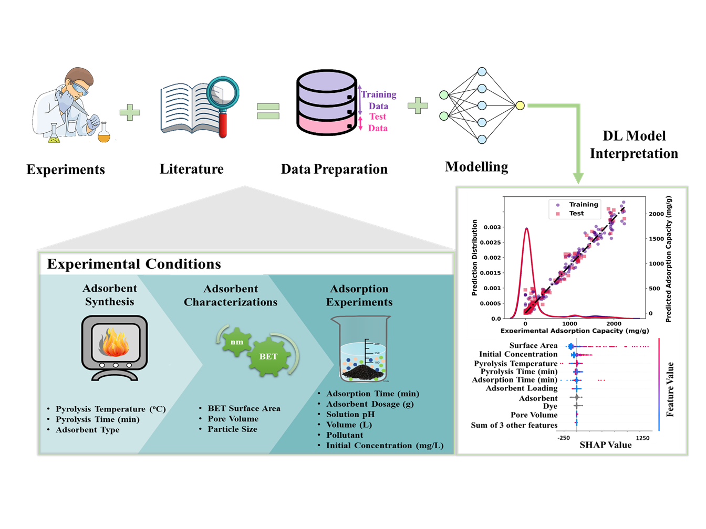

Adsorption capacity prediction on carbon-based materials using deep learning
=============================================================================

In this study we performed data-driven modeling of adsorption capacity on
carbon-based materials by the use of artificial neural networks on a dataset
of 1514 data points. The objective was to predict
the adsoprtion capacity of various
organic based activated carbon materials towards the elimination of industrial dyes from
wastewater.
ANNs are composed of neurons and weighted relationships
between those neurons. Many of these ANN models have fully-connected layers, which implies
that all of their neurons in the ANN architecture are connected to all of the neurons in the layer
adjacent to it. we have used MLP
for modelling and prediction of adsorption capacity of synthetic dyes on the surface of AC
materials, which is a classical feed-forward ANN model. It operates on the idea of mapping
given set of input data to the corresponding set of output data. The architecture of MLP is
divided into three set of layers: input, hidden and output layer. The input receives the input
features while the output layer returns the predicted target value. The hidden layers connect the
input layers with the output layer through randomly initialized weights that are further
optimized during training of the model. A non-linear activation function is used on the output
of fully connected layer which enables the network to model non-linear relationship between
input and output. The final value that comes out of the output layer is the predicted target value
by the MLP.

Data
-----
The input confined 12 input variables, such
as the adsorption time (min), type of adsorbent, calcination temperature (oC), calculation time
(min), type of dye, initial dye concentration (mg/L), solution pH, adsorbent loading (g), volume
(L), adsorption temperature (oC), particle size (nm), surface area (m2/g) and pore volume
(cm3/g). The output variable was the adsorption capacity (mg/g). The entire dataset contains two categorical input
features, type of dye and type of adsorbent, which was changed into numerical values using
the one-hot encoding technique. Afterwards, the entire dataset was randomly divided into
two sets of 70:30, from that 70% (1059 data points) data was applied to train the ANN model,
while the remaining 30% (455 data points) of data was used as test data. 30% of the training
data was considered as validation set and was used for hyperparameter optimization.
A comprehensive analysis of data is given in
:ref:`sphx_glr_auto_examples_eda.py`

Results
--------
various performance metrics including the root-mean-square error
(RMSE), mean absolute error (MAE), and coefficient of determination (R2) was applied to
study the model performance. Pearson correlation results
showed that the adsorption capacity prediction was positively correlated with the pore volume,
BET surface area, initial concentration, solution pH, and negatively correlated with the volume,
adsorbent loading, calcination time and temperature for adsorbent synthesis.
Feature importance using SHAP analysis suggested that the adsorption
characteristics with 51.4% was the most imported in the ANN prediction followed by the
adsorption experimental condition (31.2%) and adsorbent synthesis condition (17.4%).
The ANN model
prediction performance exhibited outstanding results based on highest R2 values and lowest
errors. Moreover, SHAP feature importance analysis suggested that the adsorbent
characteristics and adsorption experimental conditions were equally important for model
prediction. The SHAP dependency analysis was further applied to model the impact of six most
important input features.

Reproducibility
---------------
To replicate the experiments, you need to install all requirements given in
requirements file .
If your results are quite different from what are presented here, then make sure
that you are using the exact versions of the libraries which were used
at the time of running of these scripts. These versions are given printed
at the start of each script. Download all the .py files in the scripts including
utils.py (:ref:`sphx_glr_auto_examples_utils.py`) file. The data is expected to be
in the data folder under the scripts folder.

.. toctree::
   :maxdepth: 2
   :caption: Scripts

   auto_examples/index